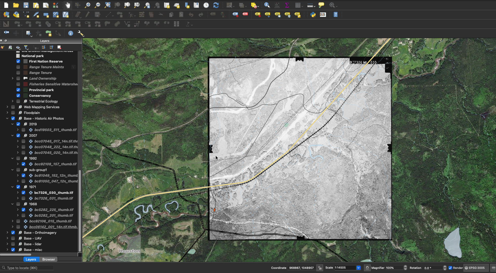
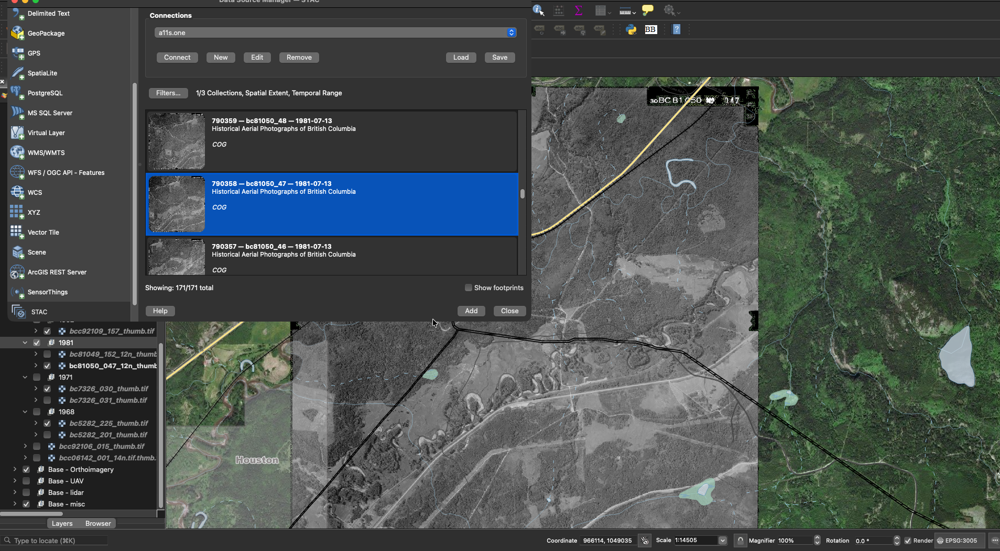

```{r setup, echo=FALSE, include = TRUE}
knitr::opts_chunk$set(echo=TRUE, message=FALSE, warning=FALSE, dpi=60, out.width = "100%")

```


```{r build, echo= FALSE, eval = FALSE}
rmarkdown::render(
  "README.Rmd",
  output_format = "github_document",
  params = list(rmd_on = FALSE, update_query = FALSE)
  )

rmarkdown::render(
  "README.Rmd",
  output_format = "html_document",
  output_file = "index.html",
  params = list(rmd_on = TRUE, update_query = FALSE)
  )
```

<!-- README.md is generated from README.Rmd. Please edit that file -->


The goal of [`stac_airphoto_bc`](https://github.com/NewGraphEnvironment/stac_airphoto_bc) is to serve georeferenced historical aerial photograph thumbnails for British Columbia as a [STAC](https://stacspec.org/) collection.  Currently covering the Neexdzii Kwa (Upper Bulkley River) watershed with 9,741 photos spanning 1963--2019.  Queryable by location and time via [`rstac`](https://brazil-data-cube.github.io/rstac/) and [QGIS (v3.42+)](https://qgis.org/) at [https://images.a11s.one](https://images.a11s.one).

<br>

This work is built on the [`fly`](https://github.com/NewGraphEnvironment/fly) R package which handles airphoto footprint estimation, spatial filtering, thumbnail downloading, and georeferencing. Sister collections on the same endpoint:

- [`stac_dem_bc`](https://github.com/NewGraphEnvironment/stac_dem_bc) — LidarBC digital elevation models (~58k GeoTIFFs)
- [`stac_uav_bc`](https://github.com/NewGraphEnvironment/stac_uav_bc) — UAV imagery organized by region / watershed-group / year

<br>

```{r fig-cover, echo=FALSE, out.width="100%", fig.align="center"}

```

<br>

## Pipeline

Source centroids from the [BC Data Catalogue](https://catalogue.data.gov.bc.ca/dataset/bc-air-photo-centroids), process through five stages:

| Step | Script | What |
|------|--------|------|
| Fetch | `01_fetch.R` | Query centroids, download thumbnails (6 parallel workers via `fly`) |
| Georef | `02_georef.R` | Warp thumbnails to estimated ground footprints (BC Albers, EPSG:3005) |
| COG | `03_cog.R` + `03_cog_tag.py` | Convert to Cloud-Optimized GeoTIFFs, embed GDAL metadata tags |
| S3 | `04_s3_upload.R` | Sync COGs + item JSONs to `s3://stac-airphoto-bc` |
| STAC | `05_stac_register.py` | Generate STAC items + collection, validate with pystac |

Run end-to-end: `bash scripts/run_pipeline.sh`

Each COG carries embedded metadata (visible in QGIS layer properties): `AIRP_ID`, `PHOTO_DATE`, `SCALE`, `FILM_ROLL`, `FRAME_NUMBER`, `FOCAL_LENGTH`, `FLYING_HEIGHT`, `FILENAME`.

<br>

## Query with rstac

```{r api1, eval=params$update_query}
library(rstac)
library(sf)

# Neexdzii Kwa watershed as AOI
aoi <- fresh::frs_watershed_at_measure(
  blue_line_key = 360873822,
  downstream_route_measure = 166030.4
) |> sf::st_transform(4326)

# Search for photos between 1965 and 1975
q <- rstac::stac("https://images.a11s.one/") |>
  rstac::stac_search(
    collections = "stac-airphoto-bc",
    intersects = jsonlite::fromJSON(
      geojsonsf::sf_geojson(aoi, atomise = TRUE, simplify = FALSE),
      simplifyVector = FALSE
    ) |> (\(x) x$geometry)(),
    datetime = "1965-01-01T00:00:00Z/1975-12-31T00:00:00Z"
  ) |>
  rstac::post_request()

r <- q |> rstac::items_fetch()

saveRDS(r, "data/stac_result.rds")
```


```{r tab-make, eval=file.exists("data/stac_result.rds")}
r <- readRDS("data/stac_result.rds")

tab <- tibble::tibble(
  title = purrr::map_chr(r$features, ~ purrr::pluck(.x, "properties", "title", .default = .x$id)),
  url = purrr::map_chr(r$features, ~ purrr::pluck(.x, "assets", "thumbnail", "href"))
) |>
  dplyr::mutate(
    link_view = ngr::ngr_str_link_url(
      url_base = "https://viewer.a11s.one/?cog=",
      url_resource = url,
      url_resource_path = FALSE,
      anchor_text = title
    ),
    link_download = ngr::ngr_str_link_url(
      url_base = url,
      anchor_text = basename(url)
    )
  ) |>
  dplyr::select(link_view, link_download)
```

`r if (params$rmd_on == FALSE) "Please see http://www.newgraphenvironment.com/stac_airphoto_bc for published table of collection links/details."`

```{r tab-results, echo=FALSE, eval=identical(params$rmd_on, TRUE) && file.exists("data/stac_result.rds")}
tab |>
  DT::datatable(
    caption = "Airphoto thumbnail COG links (1965--1975, Neexdzii Kwa watershed).",
    escape = FALSE,
    options = list(pageLength = 10)
  )
```

<br>

## QGIS Integration

As of QGIS 3.42, STAC items can be accessed directly via the Data Source Manager. Connect to `https://images.a11s.one` and browse the `stac-airphoto-bc` collection. See [this blog](https://www.lutraconsulting.co.uk/blogs/stac-in-qgis) for details.

Items display with descriptive titles (`airp_id -- roll_frame -- date`) for easy identification:

```{r echo=FALSE, fig.cap="Browsing the airphoto collection in QGIS STAC Data Source Manager"}

```

<br>

## Roadmap

- **Watershed expansion** — the current collection covers the Neexdzii Kwa watershed (9,741 photos, 1963–2019). Extending to additional BC watersheds is the natural next step; the pipeline is parameterized by AOI so adding a watershed is mostly a fetch + georef + register cycle.
- **Rotation-corrected georeferencing** — landed in the most recent rebuild via [`fly`](https://github.com/NewGraphEnvironment/fly) v0.3.0; tracks the upstream `fly` roadmap for accuracy improvements (footprint geometry from flight metadata: focal length, flying height, tilt).
- **Shared STAC-infrastructure direction** — improvements landing in the sister `stac_*_bc` repos (true-footprint geometry, uv-based Python dependency management, structured logging + benchmarking) apply here too.

Browse [open issues](https://github.com/NewGraphEnvironment/stac_airphoto_bc/issues) for the current backlog.

## Related

- [`fly`](https://github.com/NewGraphEnvironment/fly) -- R package for airphoto footprints, filtering, fetching, and georeferencing
- [`stac_dem_bc`](https://github.com/NewGraphEnvironment/stac_dem_bc) -- British Columbia LidarBC DEM collection
- [`stac_uav_bc`](https://github.com/NewGraphEnvironment/stac_uav_bc) -- UAV imagery collection
- [images.a11s.one](https://images.a11s.one) -- STAC API endpoint
